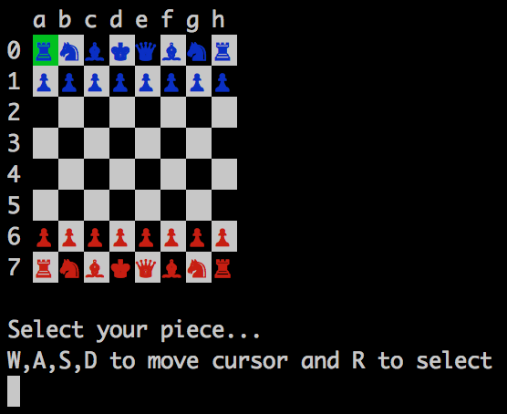

# Chess

### How to Play
---

In order to play, you must first have Ruby installed on your computer. You can then download the source code, pull up your command line utility (Terminal, iTerm, etc.), and navigate to the directory.

From there, execute the following code in terminal

```
ruby chess.rb
```

This will begin the game. During the game, the `w`, `a`, `s`, and `d` keys will move the cursor around the board. You then use the `r` key to select a piece and move it to the selected destination.

At any time during a game, you can quit by using the `q` key. The game will ask if you wish to save your game. Enjoy!


